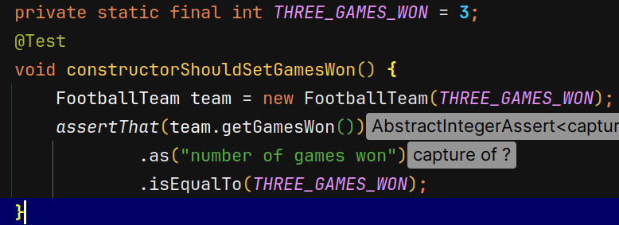
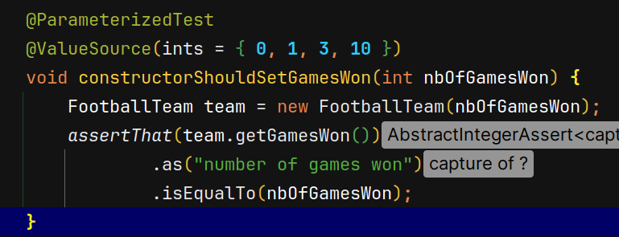

# Actividad 6 : Desarrollo guiado por pruebas

El objetivo de esa actividad es lograr comparar dos equipos de futbol, para lograr esto necesitamos
que cada equipo logre recordar el numero de juegos ganados, y eso lo logramos con el constructor de la clase.
 Para ello vamos a crear una prueba que lo verifique, de la sigueinte manera:

Ahora que tenemos creado nuestra prueba, vamos a crear nuestro codigo de produccion
en nuestro caso dejamos que nuestro IDE nos ayude:

Luego sin hacer cambios en nuestro codigo de produccion, verificamos que la prueba falle:

Agregamos `.as("number of games won")` en el codigo de prueba:

Esto sirve si alguna vez se rompe el codigo en esta prueba en concreto, etonces el mensaje especificado
nos dara mas informacion de exactamente que cosa esta fallando.

Bien, ahora vamos a escribir el codigo de produccion justo para que pueda pasar esta prueba:

verificamos que la prueba pase:

Claro de que esta implementacion es tonta pero es justo para que nuestra prueba pase, eso quiere decir que deberiamos
reforzar nuestra prueba, antes de hacer esto vamos a seguir el ciclo RGR terminando con la refactorizacion:

Ejecutamos la prueba

Bien, la prueba pasa pero no es suficiente, como dijimos antes debemos de hacer nuesstra prueba mas robusta, para lograr
eso podemos usar una prueba parametrizada, donde ya no insertemos un valor constante, sino de que pasemos una serie de 
valores para un parametro en especifico para que se prueben uno a uno y de esa manera comprobar si las pruebas se estan
cumpliendo:

De esta manera la prueba ya no se centra en un valor en especifico, sino mas bien puede comprobar varios valores y comprueba
que todos ellos pasen, corremos la prueba para corroborar:

Como era de esperarse, las pruebas fallan excepto en una, que es el valor de 3 ya que en ese caso el codigo de produccion
retorna dicho valor, por lo que debemos de cambiar nuestro codigo de produccion para poder hacer pasar esta prueba:

Para solucionar eso, etonces pasamos como parametros los juegos ganados del futbolTeam como parametro del constructor.
Corremos las pruebas otra vez:

Bien ahora que verificamos que nuestro contructor ha pasado exitosamente las pruebas, debemos verificar que nuestro 
contructor atrape una excepcion cuando recibimos un valor del parametro invalido, en este caso cuando el numero de jugadas
ganadoras son negativas.

Corremos las pruebas:

Notamos que las pruebas fallan, ya que actualmente el constructor acepta cualquier valor. Agregamos esta excepcion al
constructor:

Verificamos las pruebas:

Bien ahora que el constructor esta bien escrito (lo sabemos ya que todas las pruebas pasan satisfactoriamente) podemos
seguir escribiendo mas pruebas, recordemos que nuestro objetivo es de que queremos que nuestra clase sea comparable,
entonces escribimos el test de prueba:

Corremos las pruebas:

Reescribimos el codigo de produccion para hacer pasar la prueba:

Ahora si las pruebas pasan satisfactoriamente. A partir de ahora podemos seguir el ciclo RGR hasta seguir el ultimo paso
donde pasan todas las pruebas:

