# Ejercicio 1
juego de la trivia

Reglas:

1. Inicio del juego: Al lanzar el juego, se debe mostrar un mensaje de bienvenida junto con las instrucciones sobre cómo jugar.
2. Número de rondas: El juego constará de un total de 10 rondas, cada una con una pregunta
única.
3. Preguntas: Se presenta una pregunta con cuatro opciones de respuesta numeradas. Solo
una opción es correcta.
4. Selección de respuesta: El jugador elige su respuesta ingresando el número correspondiente
a la opción elegida.
5 Puntuación: Cada respuesta correcta otorga un punto. No se penaliza por respuestas
incorrectas.
6. Fin del juego: Al finalizar las rondas, se muestra la puntuación total del jugador, junto con un
desglose de respuestas correctas e incorrectas

Ahora veamos los sprints del proyecto:

# Sprint 1:

1. Configurar el entorno del proyecto utilizando Gradle, incluyendo la dependencia para JUnit5.

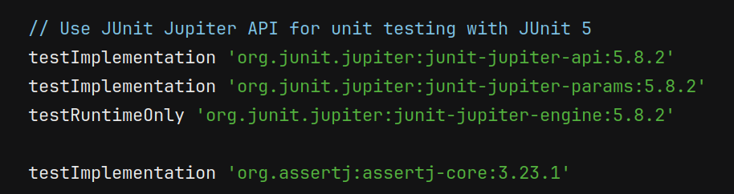

2. Desarrollar la clase Question con atributos para la descripción de la pregunta, las opciones disponibles y la respuesta correcta.

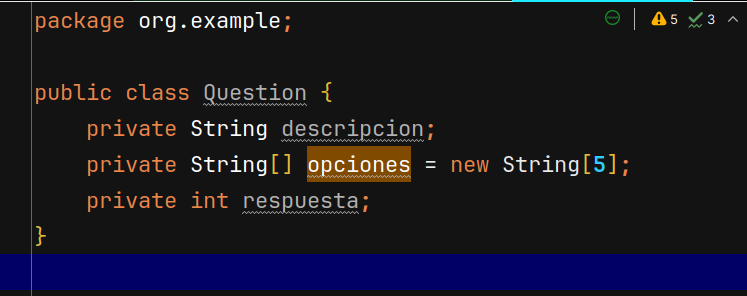
   
3. Implementar la clase Quiz que manejará el flujo del juego, incluyendo cargar preguntas,presentarlas al usuario y recibir respuestas.

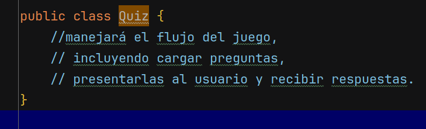
   
4. Programar la lógica para mostrar preguntas de manera secuencial y permitir al usuario ingresar respuestas.
   
  a. Primero empezemos por implementar la Clase Quiz

  definimos el contructor Quiz admitiendo el numero de preguntas totales
  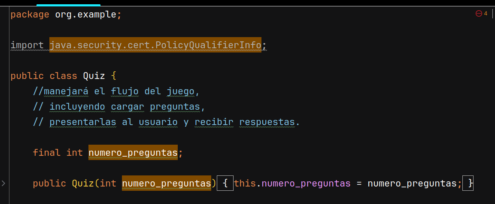

  b. Luego en la clase Question vamos a implementar los atributos y metodos para manejar la logica del juego
  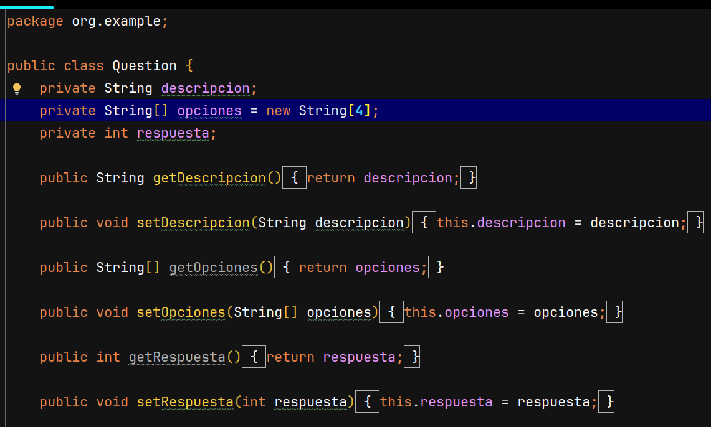

  c. Vamos a implementar un switch en la clase Quiz para manejar las preguntas que se deben de mostrar al usuario:
  

  d. Creamos un pequeño main para ver el funcionamiento del juego y la interaccion con el usuario
  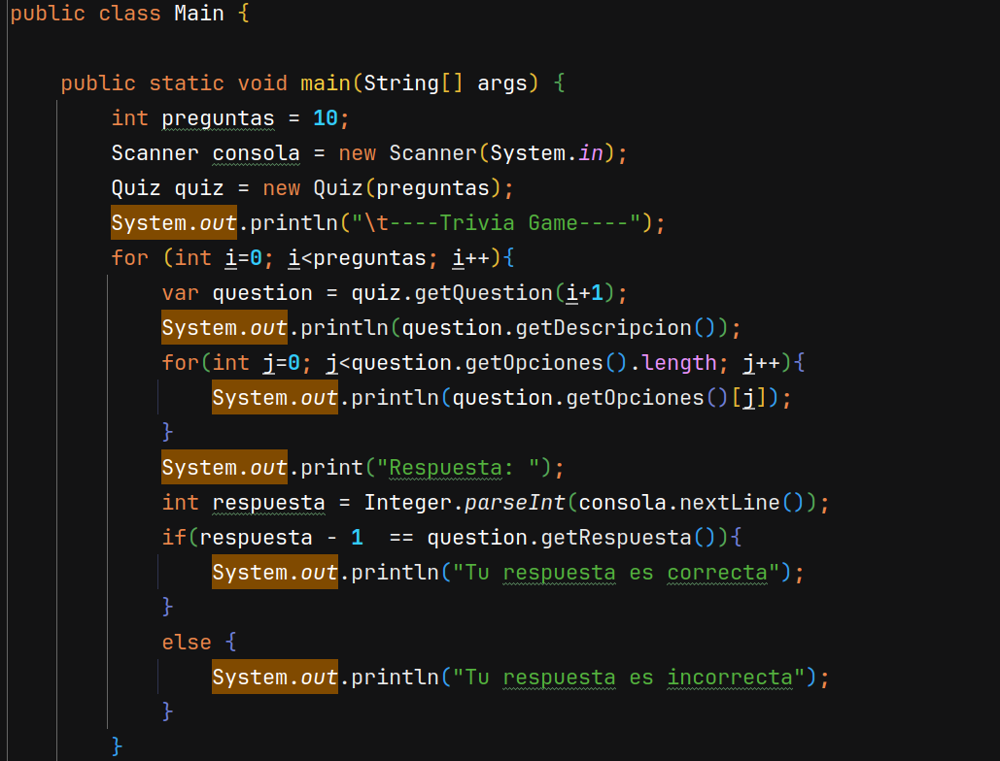

  e. Ejecutamos el main para probar el funcionamiento del juego
  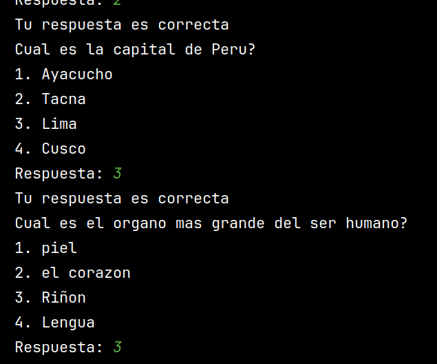

5. Escribir pruebas unitarias para asegurar que las preguntas se carguen correctamente y que las respuestas sean validadas adecuadamente.

a. Escribimos la primera prueba para validar que las respuestas que se esperan sean correctas:
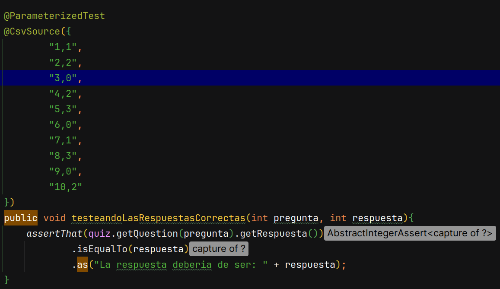

b. La segunda prueba consiste en validar que un valor fuera de rango retorne un valor nulo
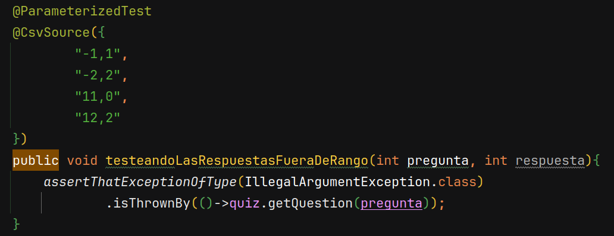

c. La tercera prueba trata de validar las respuestas incorrectas
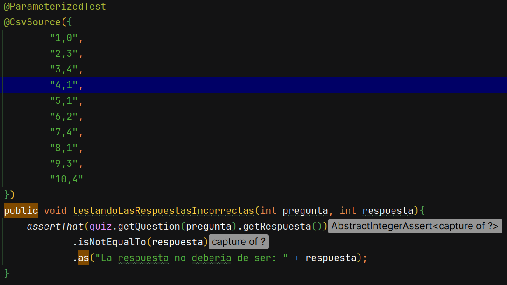

d. Por ultimo corremos las pruebas para verificar si el codigo de produccion esta bien
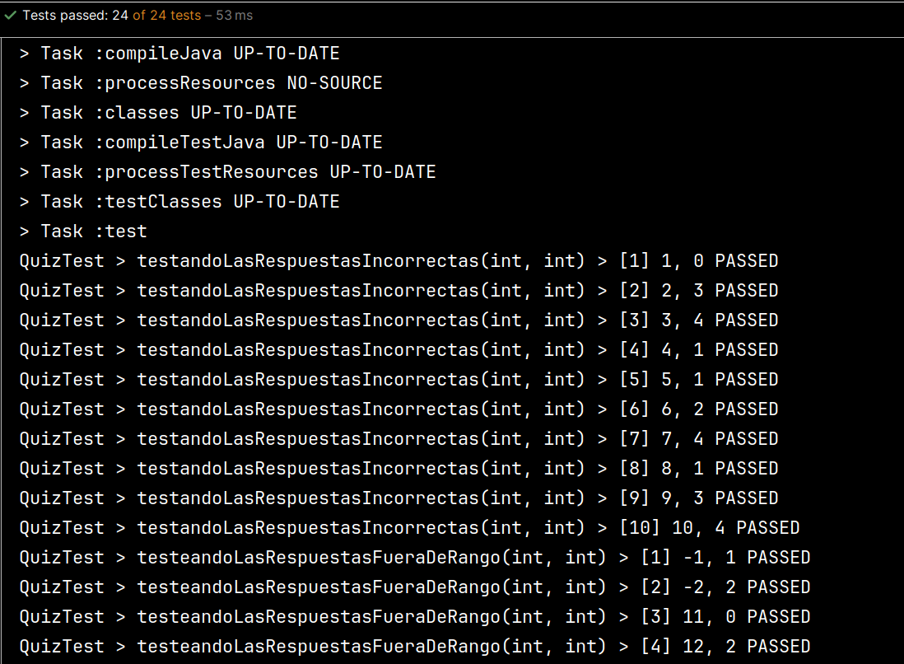

# Sprint 2:

1. Ampliar la clase Quiz para incluir un sistema de puntuación que rastree las respuestas correctas e incorrectas.
   
    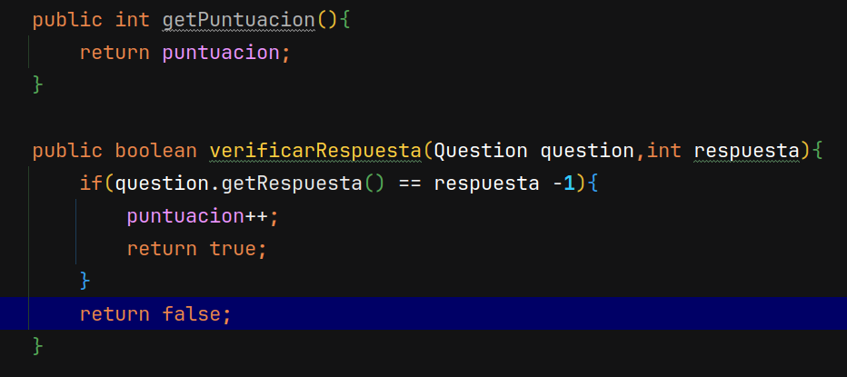

2. Implementar lógica para múltiples rondas de juego, permitiendo al juego continuar hasta que se completen todas las preguntas.

   
3. Crear un mecanismo para terminar el juego una vez que se hayan respondido todas las preguntas, y mostrar el resultado final al usuario.
   
   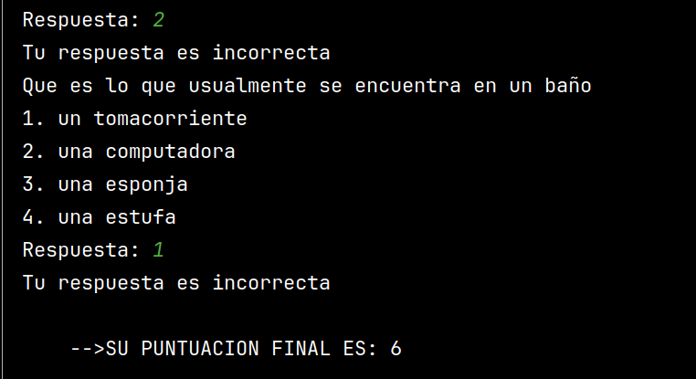
   
4. Escribir pruebas unitarias para verificar la precisión del sistema de puntuación y la correcta
funcionalidad del flujo del juego

# Sprint 3

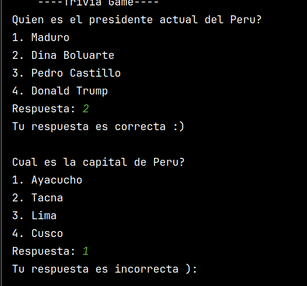

1. ¿Qué caracteriza a una metodología ágil y cómo se aplicaría al desarrollo del juego de trivia?
Respuesta: una metodologia agil es cuando se deja trabajos individuales a los desarrolladores y ellos van haciendo pequeñas entregas, se puede aplicar en este juego dejando a cada uno de ellos que hagan las clases individuales con sus respectivos test y luego juntandolo todo en un solo programa
2. Explica cómo el principio de entrega continua podría implementarse en el proyecto del juego
de trivia usando Gradle. Discute el uso de Gradle para automatizar compilaciones, pruebas y
despliegues, facilitando una integración y entrega continuas.
Respuesta: ya no tenemos que preocuparnos por las dependencias de las librerias, ya que gradle puede encargarse de ello haciendo que el desarrollo de aplicaciones sea mas flexible y dinamico para los desarroladores
3. Describa el ciclo TDD y cómo se aplicaría a una nueva característica en el juego, como la
implementación del sistema de puntuación. Explica el ciclo de "Red-Green-Refactor" y cómo
utilizaría TDD para desarrollar y validar la lógica de puntuación del juego.
respuesta: Si se puede usar TDD para las pruebas unitarias del juego pero es ideal usar pruebas de aceptacion para este caso ya que la puntuacion se ve a traves de todo el juego desde el principio a fin.
4. ¿Cuáles son los beneficios de utilizar TDD en el desarrollo de software y cómo ayuda a
prevenir regresiones en el juego de trivia?
respuesta: 
5. Proporciona un ejemplo de cómo podrías refactorizar un bloque de código del juego de
trivia para mejorar su mantenibilidad.
respuesta: se puede evitar el uso del switch creando una clase, de esa manera se puede refactorizar
6. Explica la importancia de la refactorización en los sprints de desarrollo ágil y cómo se integra
en el proceso de TDD. Discute cómo la refactorización es una parte integral del ciclo de TDD
y cómo contribuye a la mejora continua del código en un entorno ágil.
respuesta: la refactorizacion es parte crucial para el desarrollo ya que ayuda a entender mejor el codigo, tener el codigo limpio es una ventaja para poder escalar la aplicacion
7. Describe cómo JUnit 5 puede utilizarse para implementar pruebas parametrizadas en el
juego de trivia. Proporciona un ejemplo concreto. Explica la funcionalidad de las pruebas
parametrizadas en JUnit 5 y cómo se podría usar para probar diferentes casos de entrada
para validar la lógica del juego.
respuesta: justamente en mis pruebas use pruebas parametrizadas para validar varias entradas en mi juego y den la respuesta esperada
8. ¿Qué características nuevas introduce JUnit 5 que son particularmente útiles para proyectos
complejos como el juego de trivia?
respuesta: el setup y el teardown para dar contexto inicial y final del juego