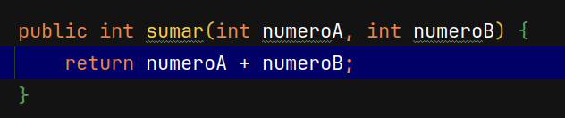
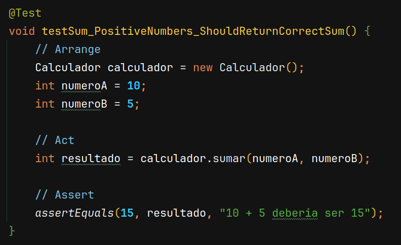
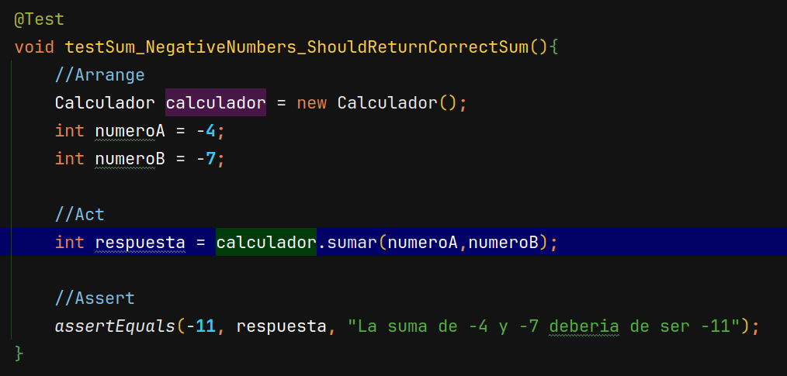
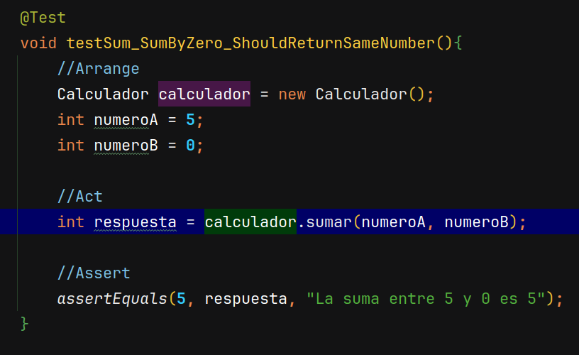
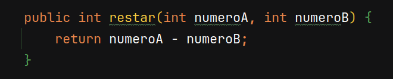
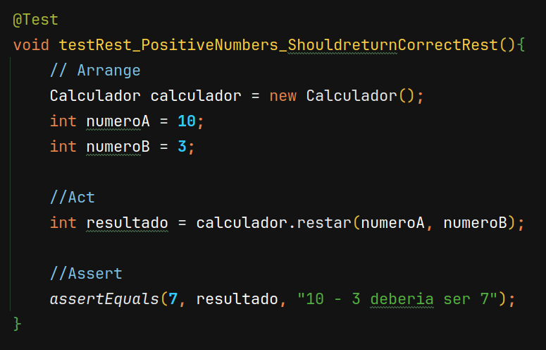
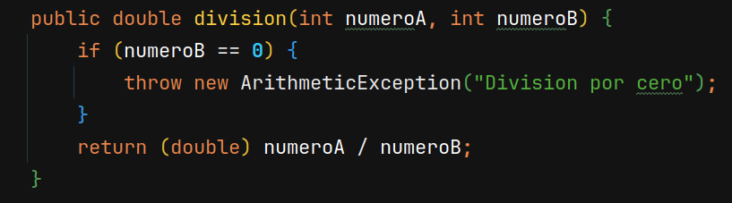
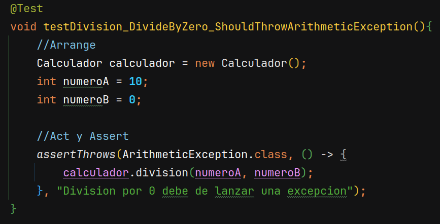

# Primera practica calificada - Desarrollo de Software

Alumno: De la Cruz Valdiviezo, Pedro Luis David

## Ejercicio 1

### Metodo suma

La actividad AAA se trata de una calculadora, en donde vamos a implementar las pruebas de los metodos que nos han proporcionado, por ejemplo tenemos el metodo suma de la siguiente manera:



Entonces en este metodo dados el ```numeroA``` y ```numeroB``` nos retorna la suma de ambos numeros. Las pruebas que hice para este metodo son las siguientes:

#### Prueba 1: La suma de dos numeros positivos deberia de dar el numero correcto



En esta prueba estamos utilizando el patron AAA que significa Arrange, Act y Assert y es donde vamos a repetir en todas las pruebas. Arrange es donde vamos a declarar nuestro nuevo objeto ```Calculador``` y tambien vamos a declarar los numeros ```numeroA``` y ```numeroB``` como 10 y 5 respectivamente, luego en Act es donde vamos a llamar al metodo que queremos probar, en este caso es el metodo ```sumar``` agregandole los argumentos declarados anteriormente y por ultimo el Assert que vamos a comprobar si el resultado deberia de dar con lo esperado, es decir que si el metodo ```sumar``` retorna el numero que deberia de retornar (que en este caso es 15 pues es la suma de 10 y 5).

#### Prueba 2: La suma de dos numeros negativos deberia de ser negativos



Como ya probamos con los numeros positivos ahora es el turno de los negativos, en este caso nuestro punto de partida son dos numeros negativos (Arrange), vamos a obtener la respuesta del metodo (Act), y por ultimo vamos a comprobar la respuesta (Assert).

#### Prueba 3: La suma por 0 deberia de retornar el mismo numero



En esta prueba estamos comprobando si la suma de un numero y 0 deberia de resultar el mismo numero. Entonces procedemos de igual manera como lo hicimos anteriormente con Arrange, Act y Assert

### Metodo restar



Este metodo ahora lo que estamos haciendo es la diferencia entre dos numeros, las pruebas que realice para este metodo los siguientes:

#### Prueba 1: La resta de dos numeros positivos deberia de retornar la resta correcta



En este caso estamos comprobando que la diferencia entre dos numeros positivos es correcta. Igualmente como hicimos con las pruebas anteriores lo comprovamos usando AAA

La Repeticion entre AAA en los metodos de prueba  nos ayuda a tener legebilidad a la hora de escribir una prueba, pues separa los "quehaceres" de una prueba en 3 partes. Igualmente hice esto para cada prueba en mi codigo (hice en total 17 pruebas) le invito a verlo. Procedere a explicar en el caso de que tengamos una excepcion en caso de una prueba, en este caso el de dividir por 0.

### Metodo division



Una de las pruebas que hice sobre este metodo es cuando tenemos una division por 0:

#### prueba division: La division por 0 deberia de retornar una excepcion aritmetica



En esta prueba nuestro Arrange es deblarar nuestro objeto ```Calculador``` seguidamente de declarar los numeros ```numeroA``` y ```numeroB``` y asegurarnos que el denominador es 0.

Ahora vamos a realizar un ```assertThrows```, este metodod comprueba si cuando hacemos la division por 0 entonces nos esta retornando la clase ```ArithmeticException```.


