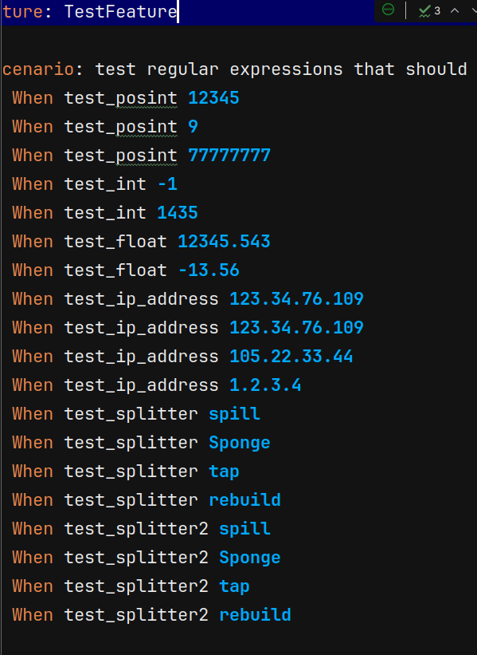
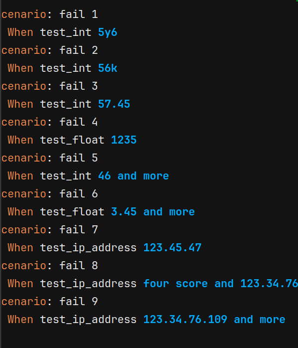

# Primera practica calificada - Desarrollo de Software

Alumno: De la Cruz Valdiviezo, Pedro Luis David

## Mi respuesta es la siguiente:

package skeleton;
import io.cucumber.java.en.When;

public class Stepdefs {
    // NOTE: because the regular expressions are within
    // Java strings, we have to make all backslashes double backslashes
    // for them to work correctly.  So, to find a decimal character,
    // rather than writing \d, you must write \\d.

    // NOTE 2: to explicitly force a pattern to start with the
    // beginning of the input string, start with ^.  To force it to
    // end at the end of the input string, use $.  For example:
    // @When("test_foo \\d") will match:
    //     test_foo 5
    // but will also match:
    //     some test_foo 5 dollars
    //     bugga bugga test_foo 1 yeeeeeehaaaaaaaaw
    //
    // On the other hand:
    // @When("^test_foo \\d$")
    // will only match: test_foo 5
    //

    // NOTE 3: to not 'capture' a pattern as an argument to the
    // Java method, use (?:<pattern>)
    // For example:
    //    @When("^match_four ((in|out)(foo|bar))$")
    // will match the words:
    //   infoo, inbar, outfoo, and outbar.
    // However, the associated Java function will require three
    // parameters: one for the 'in/out' value, one for the
    // 'foo/bar' value, and one for their concatenation.  To
    // only capture the concatenated value, use:
    //   @When("^match_four ((?:in|out)(?:foo|bar))$")
    //
    // You will probably need this to do the IP address example :)

    // Regular expression matcher for positive integers
    // Should match the string: test_posint followed by an sequence of
    // digits of arbitrary length
    @When("^test_posint (\\d+)$")
    public void test_posint(int number) throws Throwable {
        System.out.println("test_posint true for: " + number);
    }

    // Regular expression matcher for integers
    // Should match the string: test_int followed by an optional
    // minus sign followed by a sequence of
    // digits of arbitrary length
    //
    // I give you this one as a freebie!
    @When("^test_int ((-?\\d+)|(-?\\d+) and more|(\\d+)\\.(\\d+)|(\\d+)k|(\\d+)y(\\d+))$")
    public void test_int(int arg1) throws Throwable {
        System.out.println("test_int true for: " + arg1);
    }

    // Regular expression matcher for floats
    // Should match the string: test_float followed by an optional
    // minus sign followed by a sequence of
    // digits of arbitrary length followed by a period followed by
    // a second sequence of digits of arbitrary length.
    @When("^test_float (-?(\\d+)\\.(\\d+)|-?(\\d+)\\.(\\d+) and more|(\\d+))$")
    public void test_float(float arg1) throws Throwable {
        System.out.println("test_int true for: " + arg1);
    }

    // Regular expression matcher for IP addresses (though inexact).
    // It should accept four digit sequences separated by periods
    // where a digit sequence is defined as follows:
    //    Any single digit
    //    Any two digit characters if the first character is non-zero
    //    A one followed by a zero, one, or two followed by any digit

    // SEE NOTE 3 :)
    @When("^test_ip_address ((\\d+)\\.(\\d+)\\.(\\d+)|(\\d+)\\.(\\d+)\\.(\\d+)\\.(\\d+)|(\\d+)\\.(\\d+)\\.(\\d+)\\.(\\d+) and more|four score and (\\d+)\\.(\\d+)\\.(\\d+)\\.(\\d+))$")
    public void test_ip_address(String arg1) throws Throwable {
        System.out.println("test_ip_address true for: " + arg1);
    }

    // Pattern distinguisher.
    // Should match the string starting with: test_splitter arg
    // Where <arg> should match the following positive examples
    // and not the negative examples.  Note: any string not in the
    // positive or negative examples can be accepted or rejected.
    //
    // Positive:		Negative:
    // =========		=========
    // spill			si
    // Sponge			egregious
    // tap				Foul
    // rebuild			Test
    //                  top
    //                  ta
    @When("^test_splitter (spill|Sponge|tap|rebuild)$")
    public void test_splitter(String match) throws Throwable {
        System.out.println("test_splitter true for: " + match);
    }

    // Pattern distinguisher 2.
    // Should match the string starting with: test_splitter2 arg
    // Where <arg> should match the following positive examples
    // and not the negative examples.  Note: any string not in the
    // positive or negative examples can be accepted or rejected.
    //
    // Positive:		Negative:
    // =========		=========
    // spill			spall
    // Sponge			egregious
    // tap				foul
    // rebuild			test
    //                  top
    //                  tapper
    @When("^test_splitter2 (spill||Sponge||tap||rebuild)$")
    public void test_splitter2(String match) throws Throwable {
        System.out.println("test_splitter2 true for: " + match);
    }
}

- en este caso estoy usando "^test_posint (\\d+)$" para empezar con el texto "test_posint" seguido de un espacio y luego capturar un numero con un digito
- luego para "^test_int ((-?\\d+)|(-?\\d+) and more|(\\d+)\\.(\\d+)|(\\d+)k|(\\d+)y(\\d+))$" estoy capturando la cadena test_int seguido de - (opcional) luego de un numero de un digito o otro numero de un digito seguido de "and more" o tambien un numero un punto otro numero o un numero seguido de un k o un numero seguido de un "y" y terminar con un numero
- "^test_float (-?(\\d+)\\.(\\d+)|-?(\\d+)\\.(\\d+) and more|(\\d+))$" en este caso estoy diciendo que "-" es opcional seguido de un numero leugo de un punto y otro numero o "-" (opcional) seguido de un numero punto y otro numero seguido de la cadena "and more" o un numero
- y asi con todas las expresiones, lamentablemente por falta de tiempo no puedo explicar todas las expresiones que implemente

Imagenes que prueban que pasaron las expresiones regulares:

###