# Actividad 5: TDD-3
Autor: De la Cruz Valdiviezo, Pedro Luis David

## Creacion del proyecto
Creamos un proyecto Java usando Gradle en nuestro IDE ideaIntellij usando las dependencias respectivas para usar JUnit5. La jerarquia de nuestros archivos lo ordenamos de la siguiente manera:

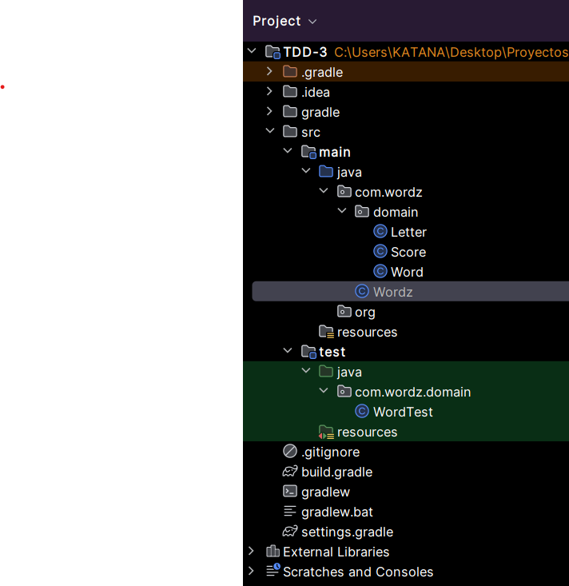

## Escribiendo las pruebas para Wordz

Agregamos una prueba para una sola letra correcta

### Comenzamose en rojo

Escribimos la primera prueba segun dada en el pdf.

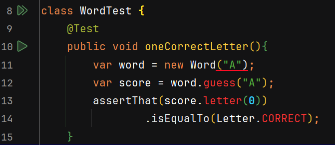

Como al inicio solo hemos implementado clases vacias es normal que al escribir esta prueba tengamos en rojo los metodos de las clases, incluso el constructor que recibe un argumento. Para solucionar esto usaremos la ayuda de nuestri IDE para generar estos metodos de manera automatica.

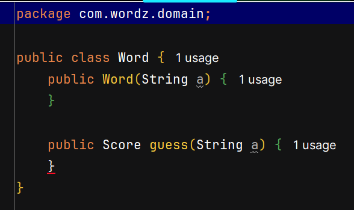

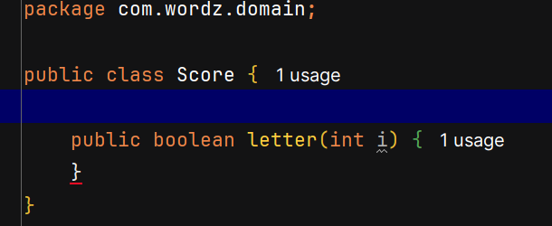

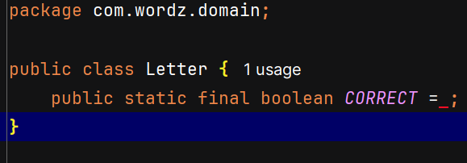

#### ¿Que hace esta prueba?

Esta prueba verifica si la palabra adivinada que en este caso es solo la letra "A" es la letra correcta creada en la instancia de la clase Word

### Agregamos el codigo de produccion

Ahora vamos a agregar el codigo de producccion de manera que pase la prueba. Empezamos con la clase Word:

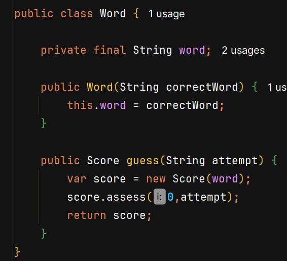

#### Explicacion:

La palabra que queremos adivinar no cambia durante todo el juego, por lo tanto lo vamos a declarar como privada y final, usaremos el contructor de la clase para inicializar esta palabra. Luego se crea un metodo guess donde recibe un String de parametro que es el intento que realiza el jugador, dentro del metodo instanciamos un objeto de Score con la palabra final word, seguidamente llamamos al metodo assess que recibe dos parametros, el primero al parecer es la posicion de la palabra, y el segundo parametro es el intento, finalmente retornamos el parametro score.

Ahora veamos la clase Score:

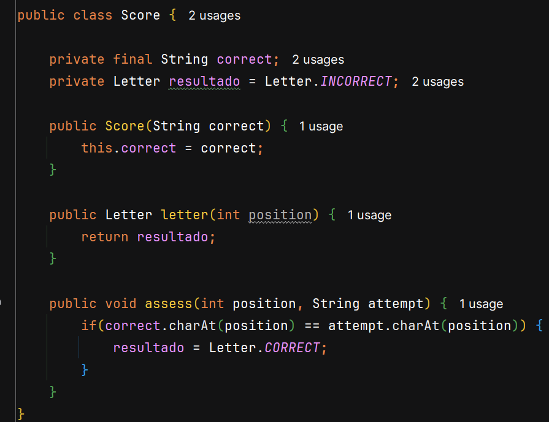

#### Explicacion:

En esta clase vamos a crear un String final llamada correct donde vamos a almacenar la palabra correcta, luego declaramos una variable de tipo Letter llamada resultado y la inicializamos con estado Incorrecta. Usamos el constructor de la clase Score para inciializar la palabra correcta, seguidamente el metodo letter donde nos da informacion del estado de una letra en la posicion dada en la palabra y por ultimo se encuentra el metodo asses que dada una posicion y el intento cambia el estado de incorrecto por correcto solo si se cumple que la letra en la misma posicion de la palabra correcta con el intento son iguales.

Ahora veamos la enumeracion Letter:

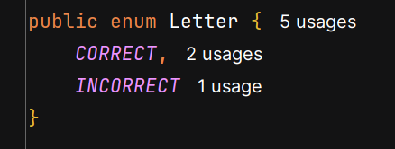

Vamos a usar la enumeracion llamada Letter cuando queremos presentar el estado de una letra en nuestro juego Wordz, por el momento tenemos los estados "CORRECT" y "INCORRECT".

### Probamos el codigo de produccion

Ahora que ya hemos agregado el codigo de produccion lo suficiente para hacer correr la prueba escrita anteriormente vamos a ejecutar la prueba a ver si logra pasar:

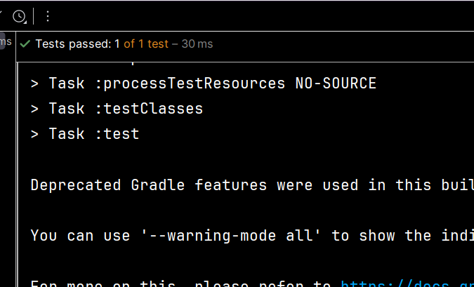

Que esta prueba pase con exito quiere decir que la prueba para adivinar una sola palabra fue un exito.

## Olor de Codigo

Un olor de codigo es una indicacion de que la implementacion puede necesitar mejoras. El nombre proviene de la idea del olor que tiene la comida una vez que comienza a perderse.

### Vamos a refactorizar

Vamos a refactorizar el siguiente codigo de Score:

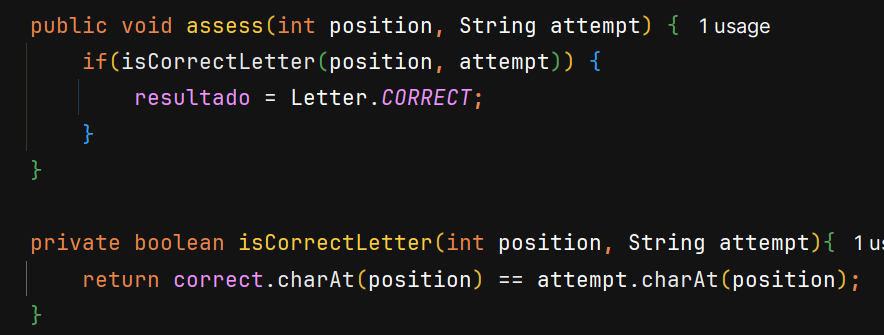

#### Explicacion:

Como mostramos anteriormente, estabamos comprobando si la letra era correcta entre la palabra a adivinar y el intento, pero para hacer mas legible el codigo y se pueda entender de mejor manera, agregamos un metodo booleano privado, donde dado la posicion y el intento nos retorne si la letra en la posicion dada es la correcta. 

Ejecutamos el test para comprobar que esta refactorizacion no ha roto nada y las pruebas pasan:

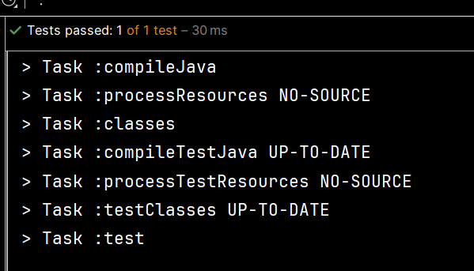

Luego vamos a reafactorizar la clase Score, de manera que solo involucre aquellas letras que se encuentren en la posicion 0. Aun no nos preocupamos si es que la palabra tiene mas de una letra ya que escribiendo la clase asi seria mas que suficiente para poder pasar la prueba:

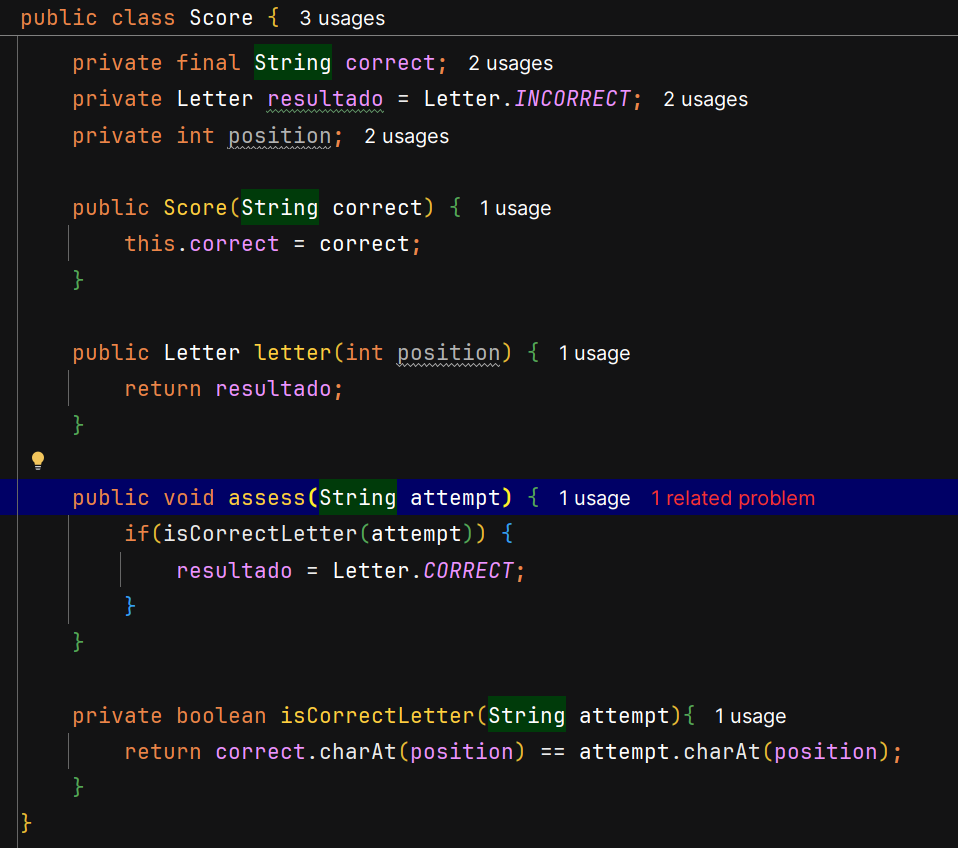

Ejecutamos el test para comprobar que esta refactorizacion no rompio nada del codigo

## Avanzando en el diseño con combinaciones de dos letras

El codigo que escribimos anteriormente ya funciona para una sola letra, ahora procederemos a escribir codigo para que acepte mas de una letra, entonces introducimos un nuevo concepto en el codigo: Una letra puede estar presente en la palabra, pero no en la posicion que adivinamos:

1. Escribimos una prueba para la segunda letra que esta en la posicion incorrecta

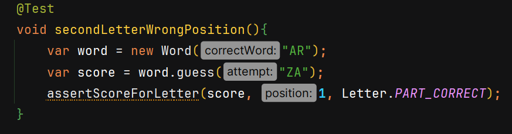

#### Explicacion:
En esta prueba estamos verificando si la letra de la posicion 1 es una letra parcialmente correcta.

2. Agregamos el codigo inicial para verificar todas las letras en nuestra adivinacion

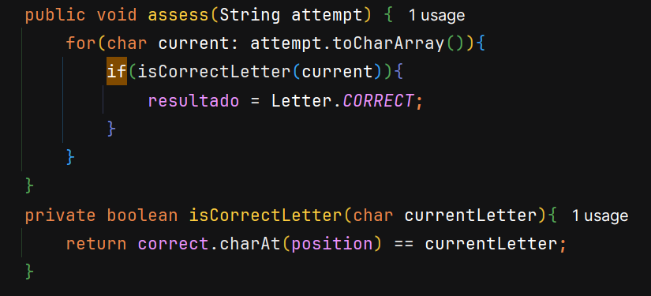

#### Explicacion:
Modificamos el metodo isCorrectLetter de manera que ahora reciba un char y retorne si las letras en la posicion position son iguales o no. En el metodo assess iteramos por cada char de attempt y verificamos si es letra correcta.

3. Agreguemos codigo para detectar cuando una letra correcta esta en la posicion incorrecta:

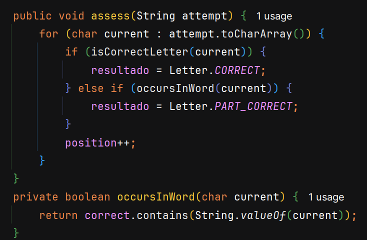

#### Explicacion:

 Para pasar las pruebas debemos de actualizar la posicion cada vez que se itera las letras de una palabra de intento, entonces si la palabra es correcta el resultado sera letra correcta, si no es correcta pero si la letra esta contenida en la palabra a adiviar entonces la letra es parcialmente correcta, sino permanece en el estado de incorrecto.

 Verificamos que las pruebas pasen con exito:

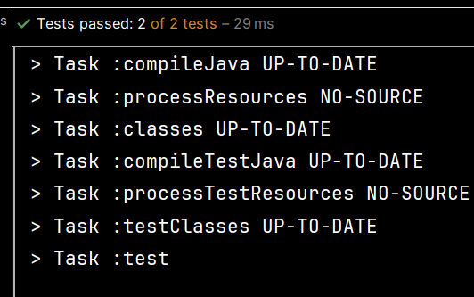

4. Agregamos una prueba para probar los tres estados de una letra

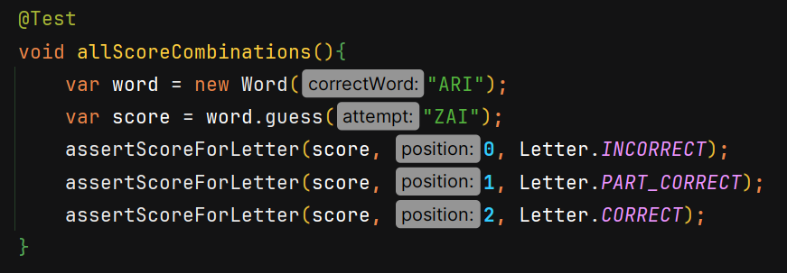

 #### Explicacion:

En este test vamos la palabra correcta sera ARI, mientras que el intento es ZAI, entonces vamos a evaluar 3 estados que puede tener una letra, una letra correcta, parcialmente correcta y por ultimo una palabra incorrecta

5. Agregar una lista List de resultados para almacernar el resultado de cada posicion de letra por separado:

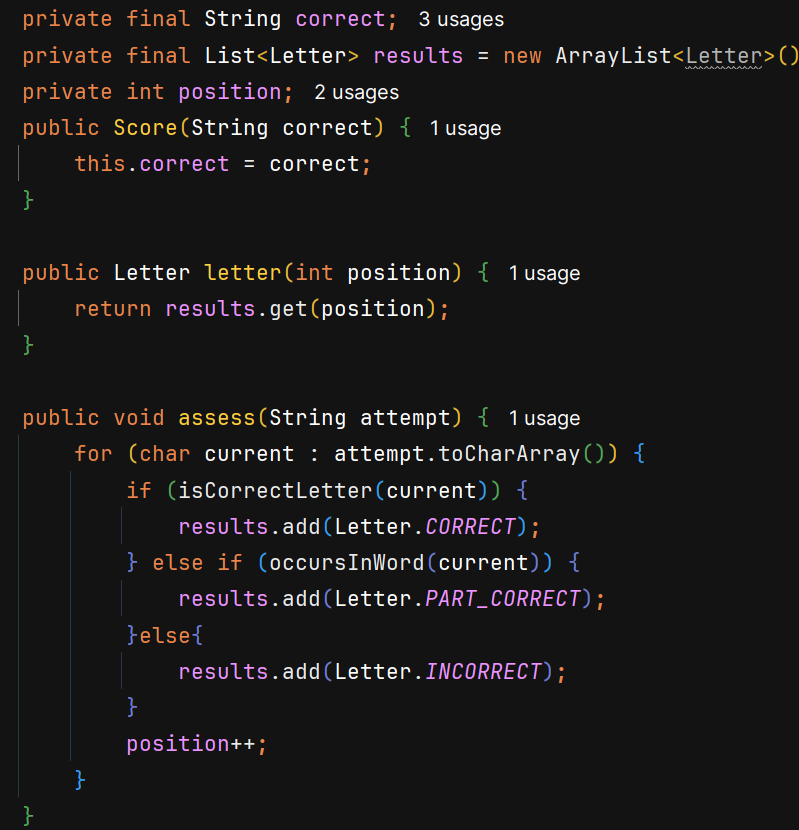

 #### Explicacion:

 En este caso vamos a crear una lista results donde vamos a almacenar todos los resultados de cada letra de un intento. Luego en el metodo letter podemos conseguir el resultado de una letra de una posicion dada. Por ultimo modificamos el metodo assess para que dado una palabra intento vamos a iterar por cada letra, para luego agregar el resultado de cada letra en la lista.

Verificamos las pruebas:

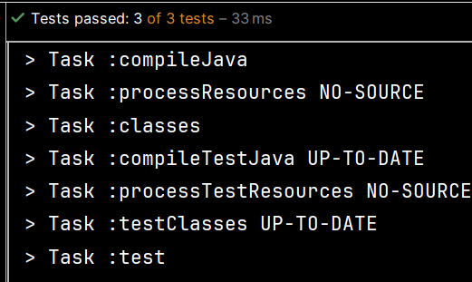

6. Extraigamos la logica dentro del cuerpo del ciclo en un metodo scoreFor() 

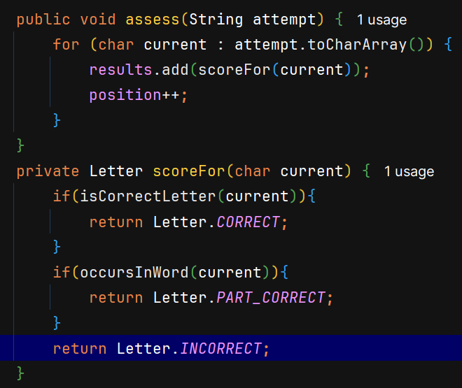

#### Explicacion:

La validacion dentro del assess que definimos en el paso anterior lo podemos refactorizar usando un nuevo metodo de tipo Letter llamado scoreFor, en este metodo dado un caracter retornamos su estado despues de hacer las respectivas validaciones.

 7. Eliminemos el codigo de asercion duplicado extrayendo un metodo

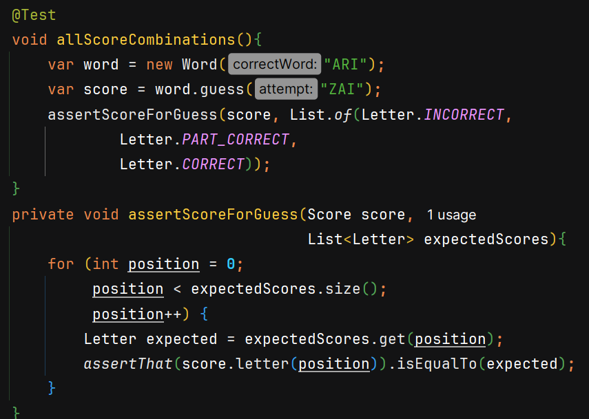

#### Explicacion:

Creamos un metodo llamado assertScoreForGuess de manera que pida como argumento el score y una lista de las los scores esperados, dentro de este metodo verificamos si cada letra correponde al score esperado.

Verificamos las pruebas:

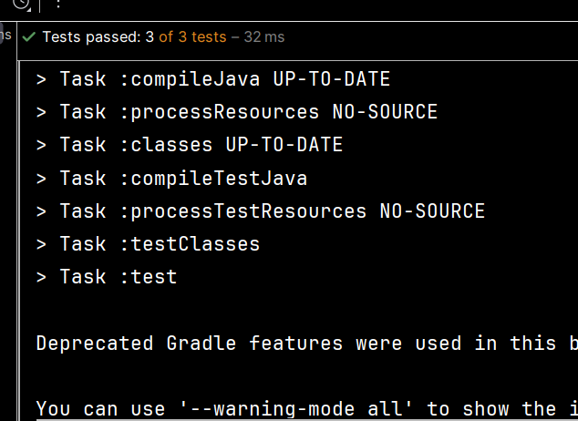

8. Ahora echemos un vistazo al conjunto final de pruebas despues de la refactorizacion:

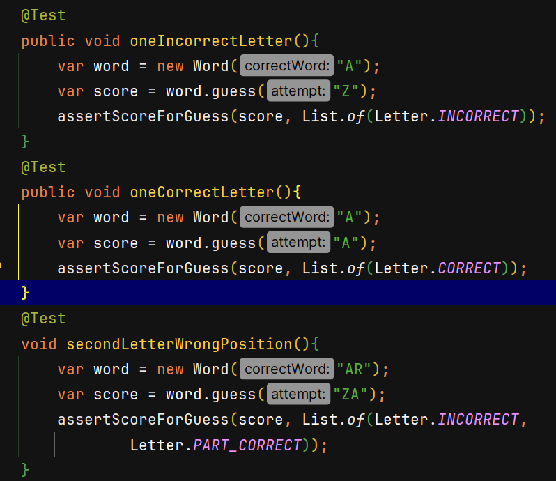
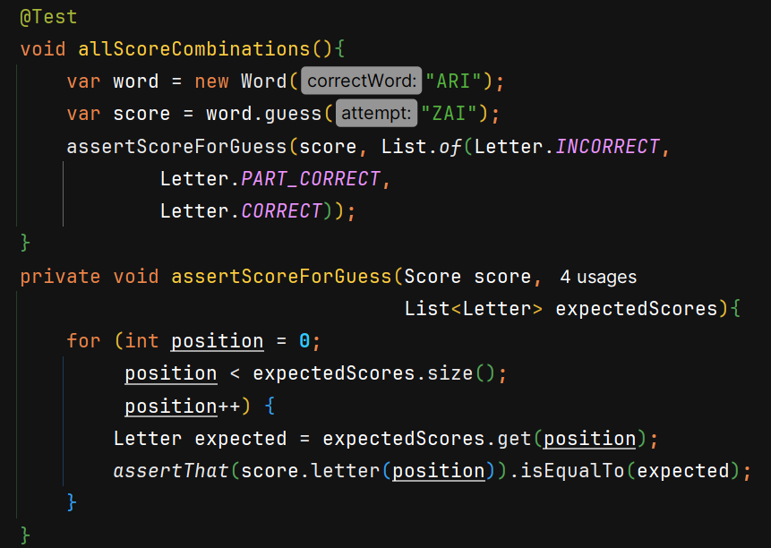

Ejecutamos todas las pruebas refactorizadas:4s

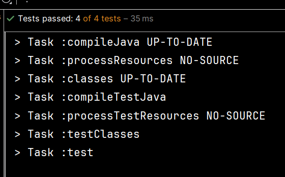
