# Introdución HTTP y URL
Grupo 6:
- Pedro Luis De la Cruz Valdiviezo
- Franklin Espinoza Pari
- Luis Angel Azaña Vega
## Comprendiendo Request y Response
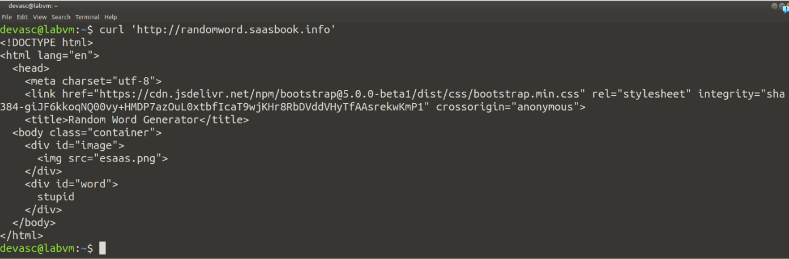
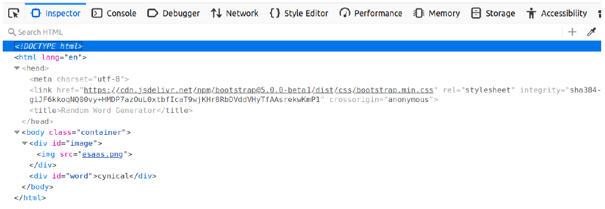
Guardamos la salida en el archivo rw.html
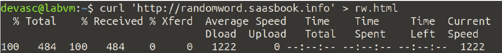
**Pregunta:**¿Cuáles son las dos diferencias principales que has visto anteriormente y lo
que ves en un navegador web 'normal'? ¿Qué explica estas diferencias?
- Respuesta: En la pagina web de randomword se puede ver la interfaz, es decir, en
  la pagina web ya esta renderizada y en la terminal solo se puede ver codigo html.
## Cómo cree el servidor que se ve una solicitud
Nos haremos pasar por un servidor Web escuchando el puerto 8081:`nc -l 8081`.

**Pregunta:** Suponiendo que estás ejecutando curl desde otro shell ¿qué URL tendrás
que pasarle a curl para intentar acceder a tu servidor falso y por qué?
- Respuesta : Tenemos que pasarle la URL http://localhost:8081 porque estamos
  ejecutando el “servidor” desde nuestra propia maquina y estamos escuchando
  desde el puerto 8081.

Abrimos otra terminal y mandamos una solicitud http al servidor falso

Retornamos al terminal donde teniamos a nuestro servidor falso escuchando y notamos
lo siguiente.

**Pregunta:** La primera línea de la solicitud identifica qué URL desea recuperar el cliente.
¿Por qué no ves http://localhost:8081 en ninguna parte de esa línea?
- Respuesta: Porque esa informacion se encuentra en el comando curl

## Veamos cómo se ve la respuesta desde el cliente.
Probaremos `curl --help` para verificar que la línea de comando
curl -i `http://randomword.saasbook.info` mostrará ambos el encabezado de respuesta
del servidor y el cuerpo de la respuesta.
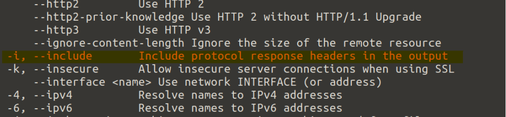
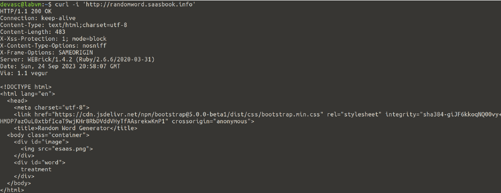
**Pregunta:** Según los encabezados del servidor, ¿cuál es el código de respuesta HTTP
del servidor que indica el estado de la solicitud del cliente y qué versión del protocolo
HTTP utilizó el servidor para responder al cliente?

- Respuesta : En la primera linea del encabezado se puede ver : HTTP/1.1 200 Ok ,
esto indica que la version es 1.1 y el estado “200 ok “ indica que la solicitud se ha
procesado correctamente

**Pregunta:** Cualquier solicitud web determinada puede devolver una página HTML, una
imagen u otros tipos de entidades. ¿Hay algo en los encabezados que crea que le dice
al cliente cómo interpretar el resultado?.

- Como habiamos visto anteirormente http://randomword.saasbook.info te devolvia
  una respuesta html y en la tercera linea podemos ver “Content-type : text//html/charset=utf-8”
  por lo que podemos considerar que esto indica que debe interpretarse como un
  codigo html

## ¿Qué sucede cuando falla un HTTP request?

**Pregunta:** ¿Cuál sería el código de respuesta del servidor si intentaras buscar una
URL inexistente en el sitio generador de palabras aleatorias? Pruéba esto utilizando el
procedimiento anterior.
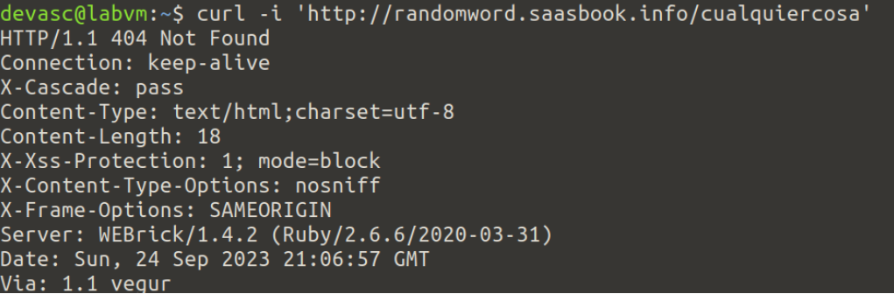
¿Qué otros códigos de error HTTP existen?
- ``200`` OK ⇒ La solicitud se ha procesado correctamente
- ``301`` Moved Permanently ⇒ El recurso solicitado a cambiado de ubicacion
permanentemente
- ``302`` Found ⇒ El recurso solicitado a cambiado de ubicacion temporalmente.
- ``400`` Bad Request ⇒ No se comprende la solicitud del cliente debido a una sintaxis
incorrecta
- ``404`` Not Found ⇒ El recurso solicitado no se enucentra en el servidor
- ``500`` Internal Server Error ⇒ Error interno en el servidor que impide que la solicitud
se procese

Tanto el encabezado ``4xx`` como el ``5xx`` indican condiciones de error. ¿Cuál es la
principal diferencia entre ``4xx`` y ``5xx`` ?.
- Respuesta : La principal diferencia esta en que 4xx se da cuando la solicitud del
  cliente es incorrecta, es decir, el error esta en el cliente y el 5xx indica un error
  interno en el servidor.

## Qué es un cuerpo de Request
Formulario HTML
Creamos el archivo Archivito.html y guardamos el formultario html
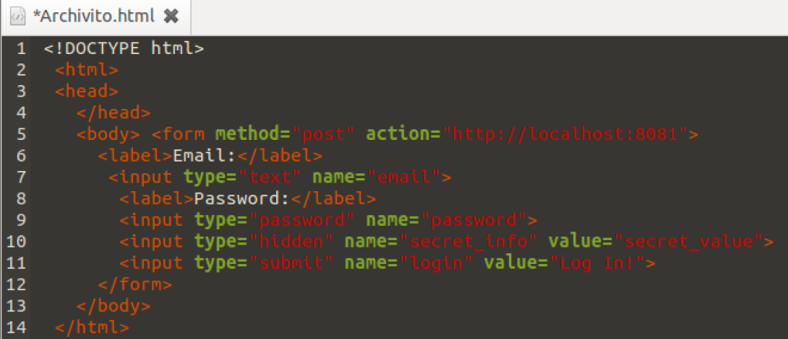
**Pregunta:** ¿con qué URL deberías reemplazar Url-servidor-falso en el archivo
anterior?
- Respuesta : Debemos cambiar la url por la de “http://localhost:8081” ya que
  tenemos un servidor falso en nuestra pc a la espera de una solicitud en el puerto 8081.

Si lo abrimos en el navegador y hacemos login
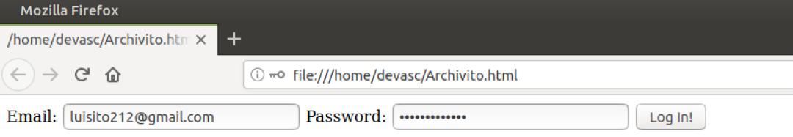

Notamos que le llega esto a la terminal donde nc esta escuchando

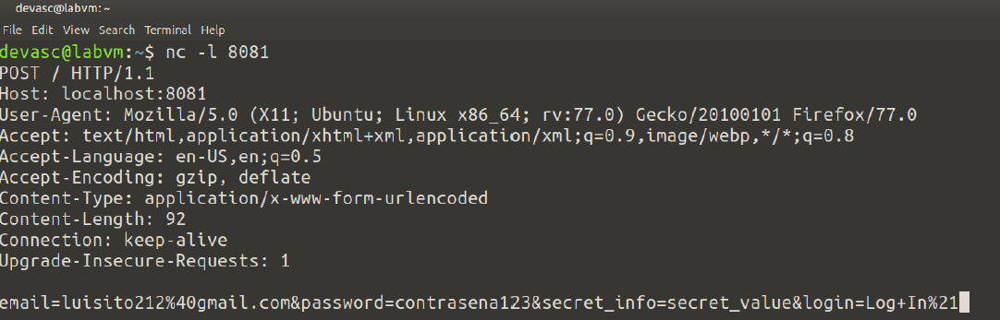
**Pregunta:** ¿Cómo se presenta al servidor la información que ingresó en el formulario?
¿Qué tareas necesitaría realizar un framework SaaS como Sinatra o Rails para
presentar esta información en un formato conveniente a una aplicación SaaS escrita,
por ejemplo, en Ruby?

Repite el experimento varias veces para responder las siguientes preguntas
observando las diferencias en el resultado impreso por nc :

- ¿Cuál es el efecto de cambiar las propiedades de nombre de los campos del
  formulario?
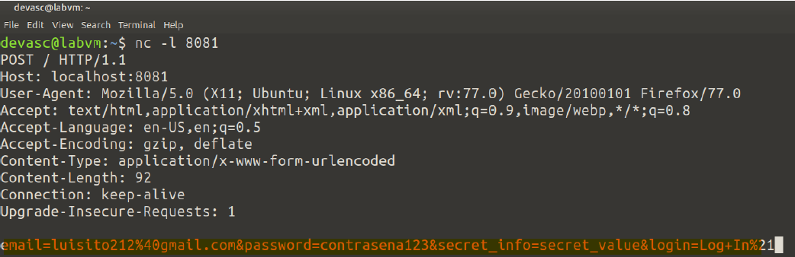
Los campos del formulario se identificarian de otra forma

- ¿Puedes tener más de un botón ``Submit`` ? Si es así, ¿cómo sabe el servidor en cuál
  se hizo clic? (Sugerencia: experimenta con los atributos de la etiqueta ``<submit>`` ).

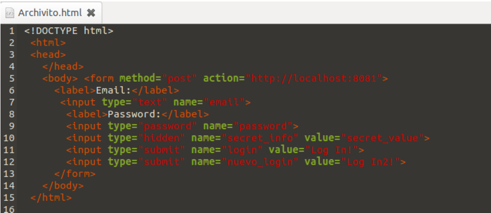  

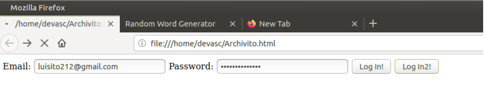

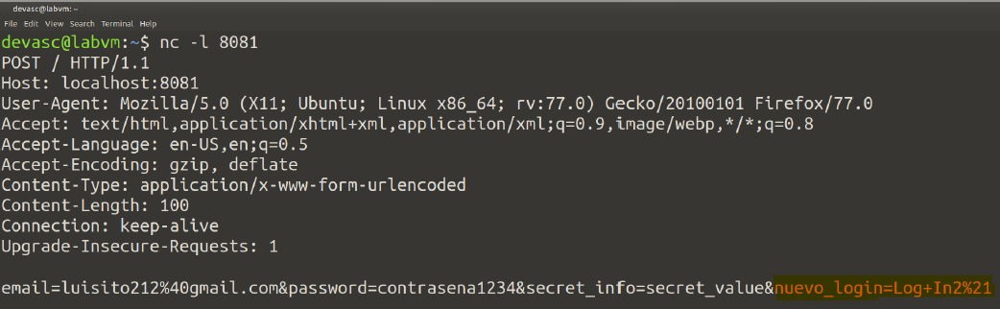

Sabe quien hizo click por el atributo “name” que existe en cada campo.

- ¿Se puede enviar el formulario mediante GET en lugar de POST ? En caso
  afirmativo, ¿cuál es la diferencia en cómo el servidor ve esas solicitudes?

Con GET, los datos del formulario son visibles en la URL como podemos ver

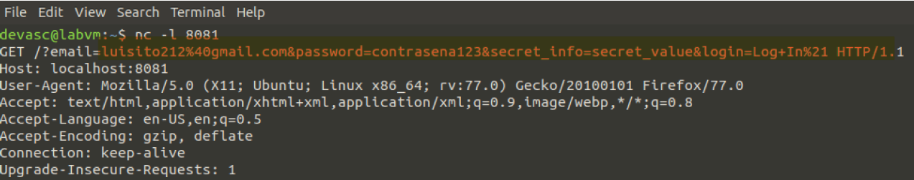

- ¿Qué otros verbos HTTP son posibles en la ruta de envío del formulario?

- **PUT:** Se utiliza para actualizar un recurso específico en el servidor.

- **PATCH:** Similar a PUT, se utiliza para actualizar un recurso en el servidor, pero
en lugar de enviar una representación completa, el cliente envía solo los
cambios o modificaciones al recurso.

## HTTP sin estados y cookies

**Pregunta:** Prueba las dos primeras operaciones GET anteriores. El cuerpo de la respuesta para la primera debe ser "Logged in: false" y para la segunda "Login cookie set". ¿Cuáles son las diferencias en los encabezados de respuesta que indican que la segunda operación está configurando una cookie? (Sugerencia: usa curl -v, que mostrará tanto los encabezados de solicitud como los encabezados y el cuerpo de la respuesta, junto con otra información de depuración. curl --help imprimirá una ayuda voluminosa para usar cURL y man curl mostrará la página del manual de Unix para cURL en la mayoría de los sistemas.)

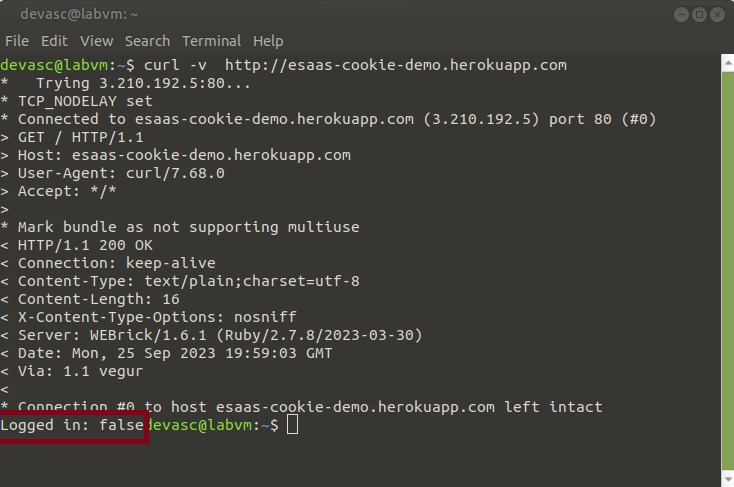

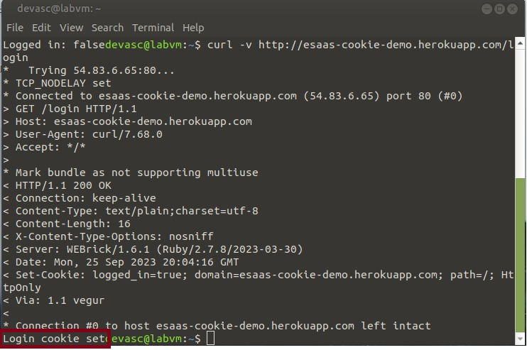

Respuesta:
Cuando un usuario ``logs in`` o ``logs off`` desde una website, el encabezado Set-cookie guarda un cookie donde almacena el estado de ``logged-in`` del usuario. En las imagenes anteriores podemos observar que realizando la operacion ``GET /login``, cambia el estado `logged-in` del usuario a ``true``.

**Pregunta:** Bien, ahora supuestamente `logged in` porque el servidor configuró una cookie que indica esto. Sin embargo, si intentaa `GET /` nuevamente, seguirá diciendo `Logged: false`. ¿Qué está sucediendo? (Sugerencia: usa `curl -v` y observa los encabezados de solicitud del cliente).

Respuesta:
Al realizar nuevamente la operacion `GET /` no le pasamos al servidor la cookie del estado `logged-in` del usuario, como consecuencia se mantiene en su estado original , es decir `logged-in = false`

Solucion al problema:
Almacenamos los cookies del encabezado `Set-cookie` en el archivo `cookie.txt` para luego mandarle al servidor a la hora de realizar la operacion `GET /`. Lo realizamos de la siguiente manera

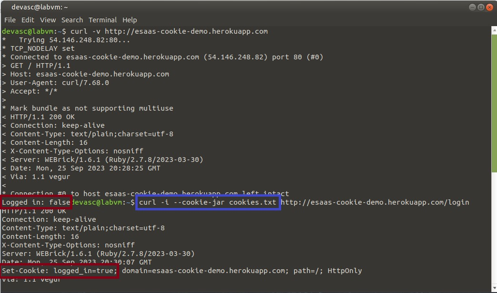

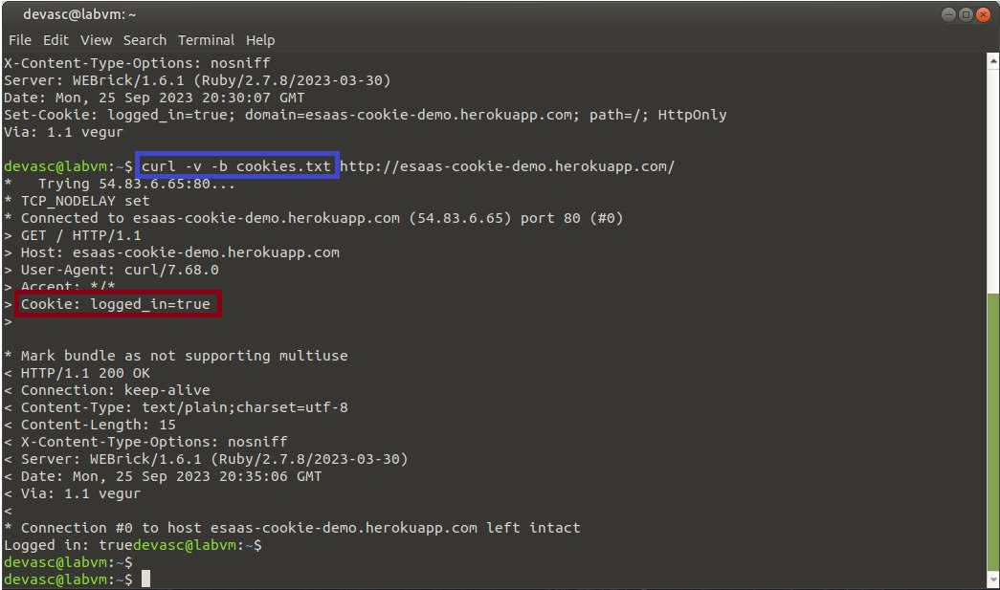

Respusta: Los servidores pueden usar diferentes mecanismos de seguridad para proteger las cookies y prevenir que los atacantes falsifiquen o manipulen informacion confidencial, se toman algunas medidas como por ejemplo el cifrado de cookies, firmas de cookies (para detectar cualquier modificacion no atorizada) 

