# Actividad git
Autor: De la Cruz Valdiviezo, Pedro Luis David

Repositorio de esta actividad: https://github.com/Defiant7426/git-intro

## Iniciando git

Como ya tenia inicializado git en mi computadora entonces puedo insertar el siguiente comando para verificar mis credenciales:

```~$ git config --list```

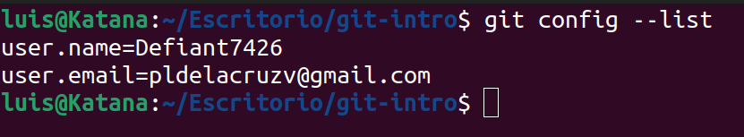

Inicializamos git y vemos los archivos ocultos:

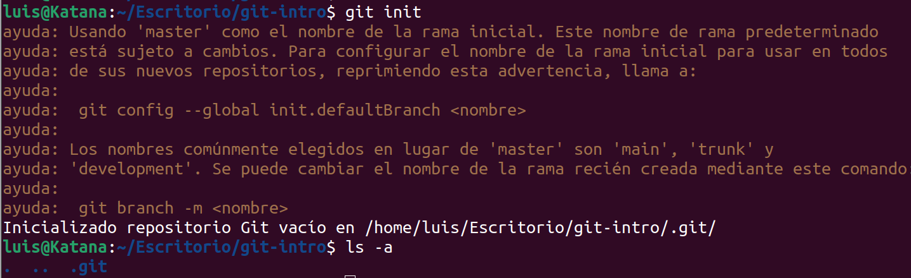

Vemos el estado inicial del repositorio:

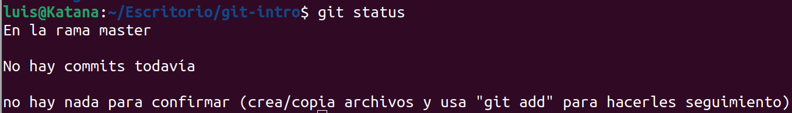

Creamos el archivo CC3S2.txt con el mensaje "Estoy en camino para pasar el examen CC3S2" en el.

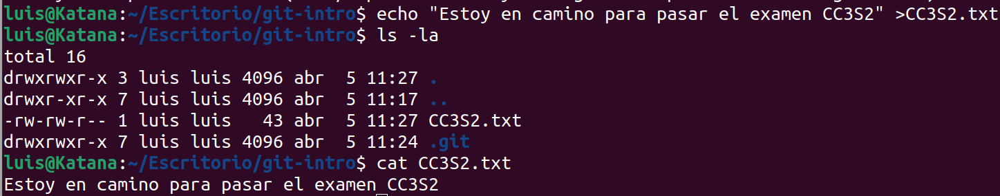

Verificamos el estado del repositorio

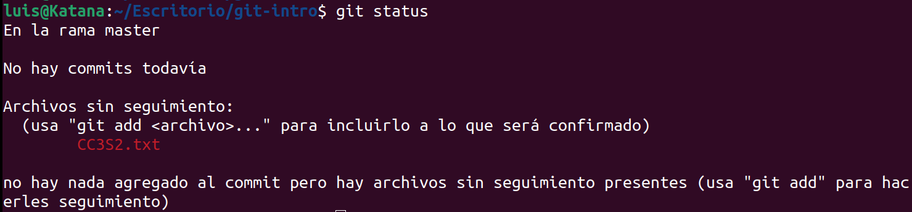

Ejecutamos el archivo y lo confirmamos con commit y tambien verificamos el estado actual del repositorio

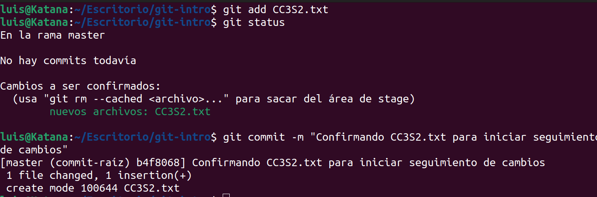

Con el comado ```~$ git log``` para mostrar todas las confirmaciones de la rama actual
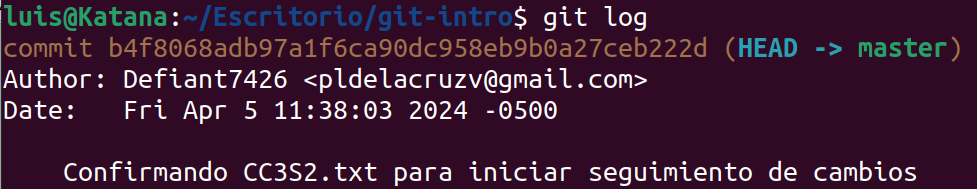

Modificamos el archivo con el comando echo y verificamos el estado del repositorio

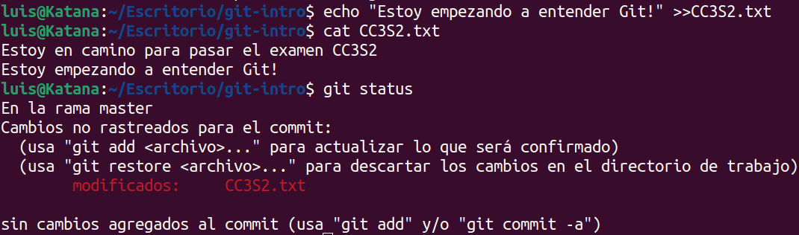

Agregamos el achivo al git y lo confirmamos con un commit y comprovamos nuevamente los cambios usando el ```~$ git log```

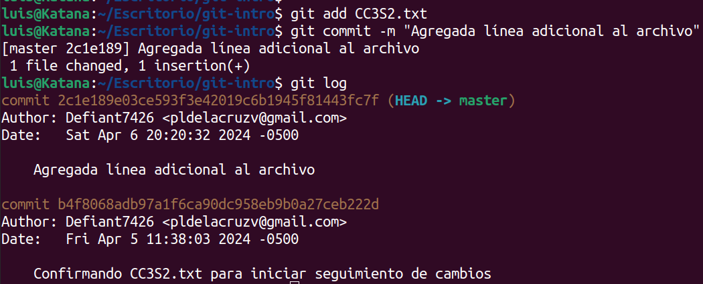

Comparamos los commit usando ```~$ git diff```

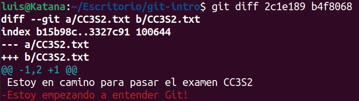

## Ramas y fusiones

Creamos una nueva rama con el comando ```git branch``` y verificamos que la rama fue creada

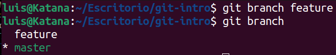

Ahora cambiamos de la rama creada y verificamos

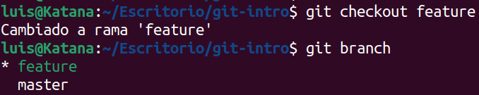

Modificamos el archivo en la rama actual y verificamos

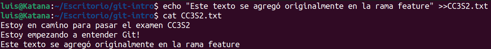

Agregamos el achivo al git y verificamos el estado, notamos que el archivo se encuentra en la rama "feature"

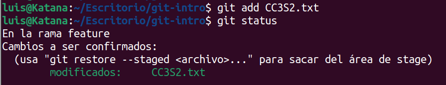

Confirmamos el archivo con un commit y verificamos todas las confirmaciones con ```~$ git log```. Notamos las confirmaciones tanto en la rama feature como en la rama master

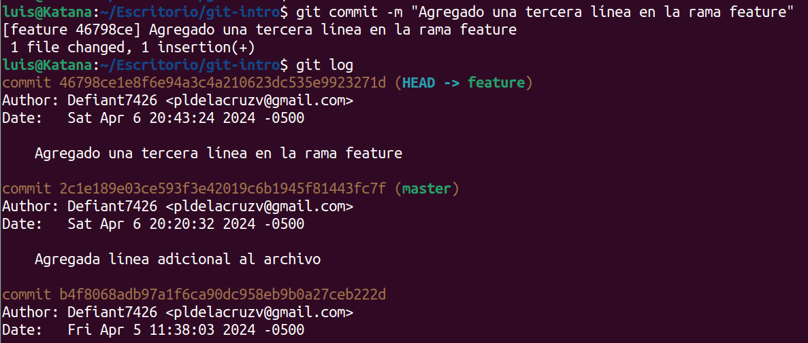

Cambiamos a la rama master usando ```git branch```

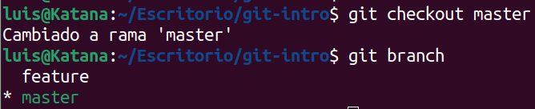

Combinamos el archivo de la rama master con la rama feature

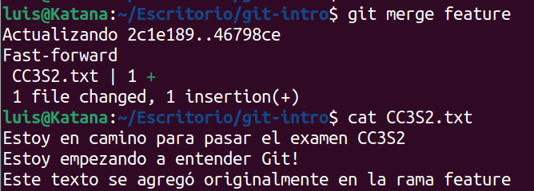

Eliminamos la rama feature y verificamos su eliminacion

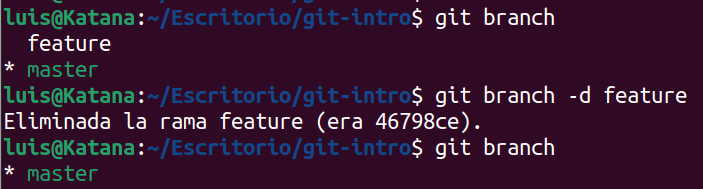

## Manejo de conflictos de fusión.

Creamos una rama llamada test, luego verificamos el estado actual del archivo CC3S2

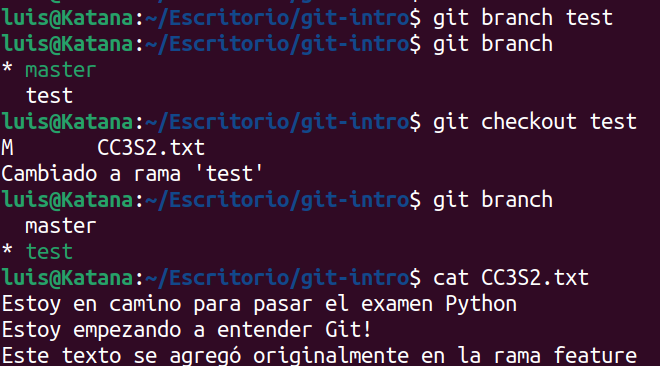

Cambiamos la palabra 'CC3S2' por Java en el archivo CC3S2.txt, luego realizamos la confirmacion con el mensaje "Cambiar CC3S2 a Java"

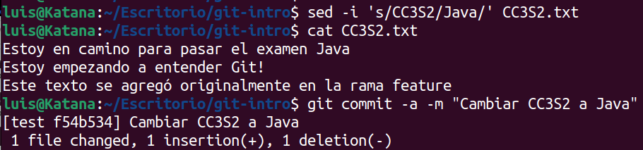

