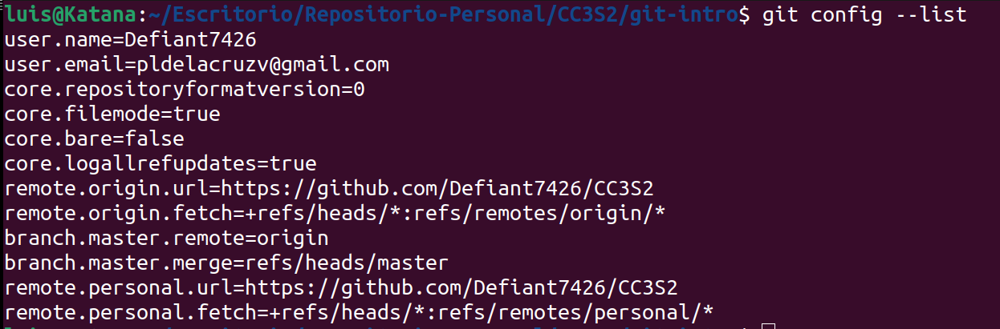
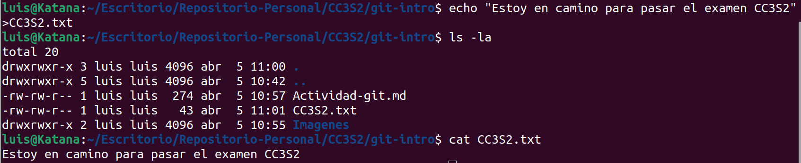

# Actividad git
Autor: De la Cruz Valdiviezo, Pedro Luis David

## Iniciando git

Como ya tenia inicializado git en mi computadora entonces puedo insertar el siguiente comando para verificar mis credenciales:

```~$ git config --list```



Creamos el archivo CC3S2.txt con el mensaje "Estoy en camino para pasar el examen CC3S2" en el.



Verificamos el estado del repositorio

